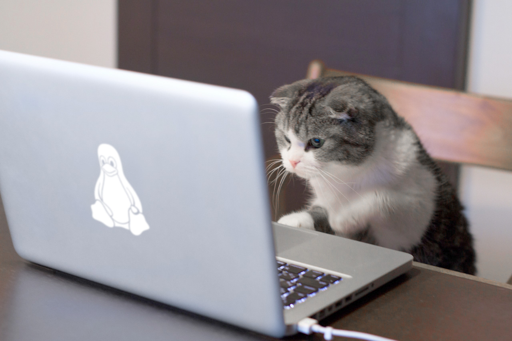

# Linux Support Engineer
We zijn altijd op zoek naar een extra Trueligans! Beheers jij onderstaande (vergelijkbare) technieken en wil je deze verder ontwikkelen, kom langs of stuur een mail.

* Linux (Ubuntu, CentOS);
* Virtualisatie technieken (KVM, Docker);
* Installation & Provisioning (PXE, Kickstart);
* Configuration & Automation (Ansible);
* Monitoring (Nagios);
* Scripting kennis (Bash, Python, of vergelijkbare tooling);
* Ervaring met Netwerktechnologie (TCP-stack, OSI-model)
* Security (SSL, hardening)
* Ervaring met cluster omgevingen (HAProxy, Keepalived, HA-stack)

Jouw belangrijkste taken en overige kwaliteiten zijn: 
* Beantwoorden van klantvragen;
* Opzetten van nieuwe klantomgevingen;
* Verbeteren van klantomgevingen;
* Onderzoeken en diagnosticeren van problemen;
* Draaien van storingsdiensten (periodiek);
* Meedenken over verbeteringen en innovatie;
* Goede communicatieve kwaliteiten, klantgericht en pro-actief;
* Een teamspeler, die tevens goed zelfstandig kan werken;
* Minimaal (m|h)bo werk-en denkniveau en humor :)

## Wat biedt True?
Je komt te werken in een jong, enthousiast, technisch hoogstaand team waar de traditioneel relaxte dotcom cultuur wordt gecombineerd met ambitieuze organisatiedoelstellingen. De klanten die je service verleent variëren van startups tot corporate ondernemingen. 

Naast een prima salaris biedt True interessante secundaire arbeidsvoorwaarden zoals een heerlijke, afwisselende lunch - dagelijks klaargemaakt door onze kok Jolanda. Verder kun je gratis sporten in onze inpandige gym, maar ook een bordspelletje in de bar of tafelvoetballen, poolen en retro-gamen. Tevens biedt True een internetvergoeding en volop ruimte om jezelf ontwikkelen. Je groeimogelijkheden worden afgestemd op je eigen ontwikkeling. Een collegiale en informele sfeer zorgen tenslotte voor een prettige en inspirerende werkomgeving in een trendy en industrieel kantoorpand in Amsterdam.

## Over True
True is een Nederlandse serviceprovider voor managed web- en werkplekomgevingen. Sinds 2000 groeien we sterk op het gebied van managed hosting en clouddienstenverlening rondom de digitale werkplek. True wil niet de grootste worden. Maar groots zijn. Groots in klantgedrevenheid en volledig toegewijd aan het bieden van superieure applicatie hosting- en werkplekdiensten– met de hoogst haalbare continuïteit, veiligheid en prestaties – op de meest efficiënte en plezierige manier.

Klanten zijn o.a. Tweakers, VakantieVeilingen, Mollie en ID&T. Qua managed werkplekomgevingen richten wij ons op de productie & (maak)industrie, transport & logistiek, de zorgsector, grafische industrie, non-profit en zakelijke dienstverlening. Klanten zijn o.a. De Vegetarische Slager, Bakkersland en Nabuurs. 

https://www.true.nl - info@true.nl
